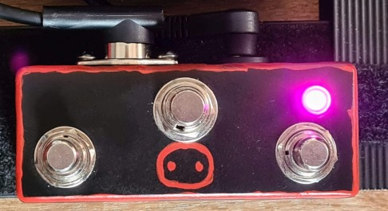
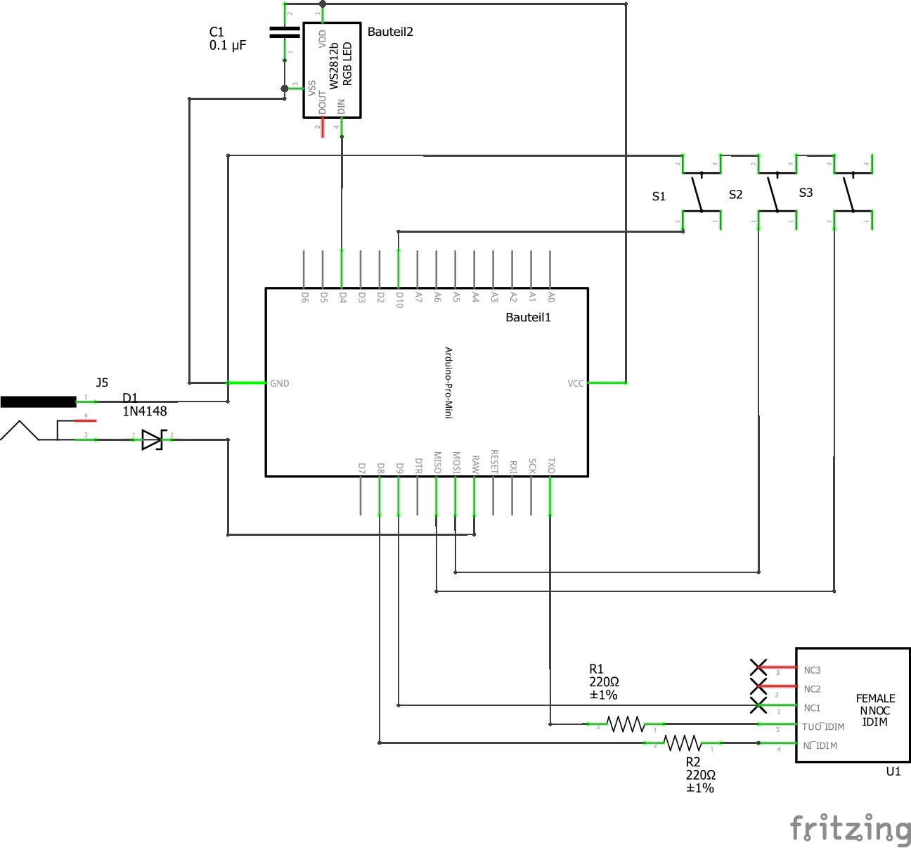

# HXstomp_Midi

## Banks and Functions

| Bank              |            |          0          |            |
| :---------------- | :--------: | :-----------------: | :--------: |
| **Description**   |            |    Snapshot Mode    |            |
| **On Bank Enter** |            | Stomp to Stomp mode |            |
| **Button**        |   **A**    |        **B**        |   **C**    |
| **Short Press**   | Snapshot 1 |     Snapshot 2      | Snapshot 3 |
| **Long Press**    | FS Mode Up |    Boost CC 100     |  Bank Up   |

---

| Bank              |              |         1          |               |
| :---------------- | :----------: | :----------------: | :-----------: |
| **Description**   |              |     Tap/Tuner      |               |
| **On Bank Enter** |              | Stomp to Snap mode |               |
| **Button**        |    **A**     |       **B**        |     **C**     |
| **Short Press**   | Toggle tuner |     Tap Tempo      | Toggle Bypass |
| **Long Press**    |  FS Mode Up  |    Boost CC 100    |    Bank Up    |

---

| Bank              |            |         2          |               |
| :---------------- | :--------: | :----------------: | :-----------: |
| **Description**   |            |      FS Mode       |               |
| **On Bank Enter** |            | Stomp to Snap mode |               |
| **Button**        |   **A**    |       **B**        |     **C**     |
| **Short Press**   |    FS4     |        FS5         | Toggle CC 101 |
| **Long Press**    | FS Mode Up |    Boost CC 100    |    Bank Up    |

---

| Bank              |            |         3          |           |
| :---------------- | :--------: | :----------------: | :-------: |
| **Description**   |            |    Looper Mode     |           |
| **On Bank Enter** |            | Stomp to Snap mode |           |
| **Button**        |   **A**    |       **B**        |   **C**   |
| **Short Press**   | Rec/OverD  |     Play/Stop      | Undo/Redo |
| **Long Press**    | FS Mode Up |    Boost CC 100    |  Bank Up  |

## Enable / disable Banks Completely

Banks 1, 2, and 3 can be enabled/disabled during startup

- As soon as the LED is white, long pressing the buttons `A`,`B`, and/or `C` toggles availability of banks `1`,`2`, and/or `3` respectively
- After the white LED turn of all activated Bank colors are shown once, before `Bank 0` is activated
- The bank state (enabled / disabled) is preserved

## Looper

During Operation:

- LED flashing **fast** during recording / overdubbing
- LED flashing **slow** during playback

## Routing Layout

