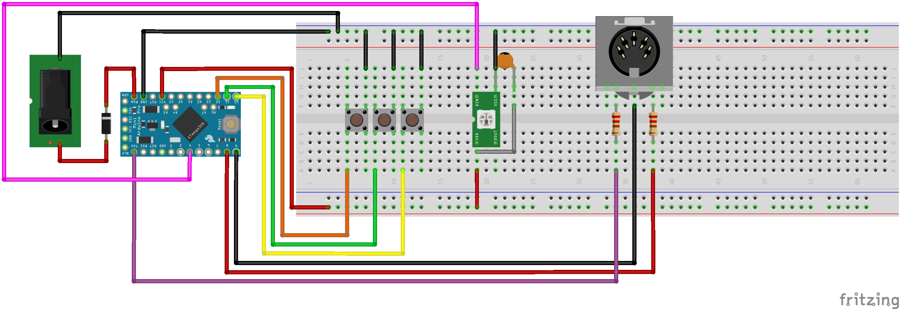

# HXstomp_Midi

## Banks and Functions

| Bank              |            |          0           |            |
| :---------------- | :--------: | :------------------: | :--------: |
| **Description**   |            |    Snapshot Mode     |            |
| **On Bank Enter** |            |  Stomp to Stomp mode |            |
| **Button**        |   **A**    |        **B**         |   **C**    |
| **Short Press**   | Snapshot 1 |      Snapshot 2      | Snapshot 3 |
| **Long Press**    | FS Mode Up |     Boost CC 100     |  Bank Up   |

---

| Bank              |              |         1          |               |
| :---------------- | :----------: | :----------------: | :-----------: |
| **Description**   |              |     Tap/Tuner      |               |
| **On Bank Enter** |              | Stomp to Snap mode |               |
| **Button**        |    **A**     |       **B**        |     **C**     |
| **Short Press**   | Toggle tuner |     Tap Tempo      | Toggle Bypass |
| **Long Press**    |  FS Mode Up  |    Boost CC 100    |    Bank Up    |

---

| Bank              |            |         2          |               |
| :---------------- | :--------: | :----------------: | :-----------: |
| **Description**   |            |      FS Mode       |               |
| **On Bank Enter** |            | Stomp to Snap mode |               |
| **Button**        |   **A**    |       **B**        |     **C**     |
| **Short Press**   |    FS4     |        FS5         | Toggle CC 101 |
| **Long Press**    | FS Mode Up |    Boost CC 100    |    Bank Up    |

## Routing Layout

